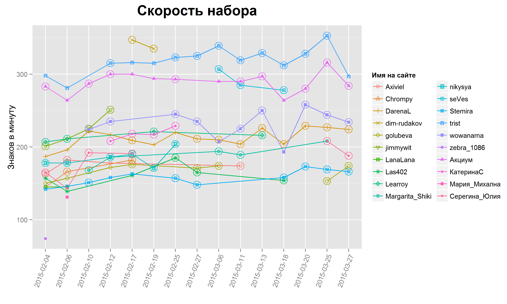

Таблица результатов
=====

<table border=1><tr><th rowspan=2>Имя на сайте</th><th rowspan=2>Место</th><th colspan=3>Получение баллов</th><th colspan=2>Статистика по всем играм</th></tr><tr><th>Всего баллов</th><th>Лучших игр</th><th>Средняя скорость</th><th>Всего игр</th><th>Средняя скорость</th></tr><tr><th colspan= 7 > Группа  1 </th></tr><!-- html table generated in R 3.1.2 by xtable 1.7-4 package -->
<!-- Mon Mar 30 01:27:44 2015 -->
  <tr> <td> trist </td> <td align="center">   1 </td> <td align="center">  81 </td> <td align="center">   9 </td> <td align="center"> 327.00 </td> <td align="center">  14 </td> <td align="center"> 317.86 </td> </tr>
  <tr> <td> Акциум </td> <td align="center">   2 </td> <td align="center">  57 </td> <td align="center">   9 </td> <td align="center"> 292.22 </td> <td align="center">  14 </td> <td align="center"> 288.71 </td> </tr>
  <tr> <td> dim-rudakov </td> <td align="center">   3 </td> <td align="center">  18 </td> <td align="center">   2 </td> <td align="center"> 341.00 </td> <td align="center">   2 </td> <td align="center"> 341.00 </td> </tr>
  <tr> <td> seVes </td> <td align="center">   4 </td> <td align="center">  16 </td> <td align="center">   3 </td> <td align="center"> 290.00 </td> <td align="center">   3 </td> <td align="center"> 290.00 </td> </tr>
   <tr><th colspan= 7 > Группа  2 </th></tr><!-- html table generated in R 3.1.2 by xtable 1.7-4 package -->
<!-- Mon Mar 30 01:27:44 2015 -->
  <tr> <td> wowanama </td> <td align="center">   1 </td> <td align="center">  75 </td> <td align="center">   9 </td> <td align="center"> 238.89 </td> <td align="center">  11 </td> <td align="center"> 231.82 </td> </tr>
  <tr> <td> DarenaL </td> <td align="center">   2 </td> <td align="center">  60 </td> <td align="center">   9 </td> <td align="center"> 216.00 </td> <td align="center">  15 </td> <td align="center"> 212.60 </td> </tr>
  <tr> <td> Learroy </td> <td align="center">   3 </td> <td align="center">  31 </td> <td align="center">   4 </td> <td align="center"> 213.75 </td> <td align="center">   4 </td> <td align="center"> 213.75 </td> </tr>
  <tr> <td> jimmywit </td> <td align="center">   4 </td> <td align="center">  30 </td> <td align="center">   4 </td> <td align="center"> 222.00 </td> <td align="center">   4 </td> <td align="center"> 222.00 </td> </tr>
  <tr> <td> КатеринаС </td> <td align="center">   5 </td> <td align="center">  24 </td> <td align="center">   4 </td> <td align="center"> 218.00 </td> <td align="center">   4 </td> <td align="center"> 218.00 </td> </tr>
  <tr> <td> Серегина_Юлия </td> <td align="center">   6 </td> <td align="center">  19 </td> <td align="center">   6 </td> <td align="center"> 157.33 </td> <td align="center">   7 </td> <td align="center"> 181.17 </td> </tr>
  <tr> <td> nikysya </td> <td align="center">   7 </td> <td align="center">  16 </td> <td align="center">   6 </td> <td align="center"> 184.50 </td> <td align="center">   6 </td> <td align="center"> 184.50 </td> </tr>
  <tr> <td> Stemira </td> <td align="center">   8 </td> <td align="center">  16 </td> <td align="center">   7 </td> <td align="center"> 160.29 </td> <td align="center">  11 </td> <td align="center"> 157.36 </td> </tr>
  <tr> <td> Margarita_Shiki </td> <td align="center">   9 </td> <td align="center">  15 </td> <td align="center">   5 </td> <td align="center"> 189.00 </td> <td align="center">   5 </td> <td align="center"> 189.00 </td> </tr>
  <tr> <td> golubeva </td> <td align="center">  10 </td> <td align="center">  14 </td> <td align="center">   6 </td> <td align="center"> 141.33 </td> <td align="center">   9 </td> <td align="center"> 165.88 </td> </tr>
  <tr> <td> Las402 </td> <td align="center">  11 </td> <td align="center">   8 </td> <td align="center">   3 </td> <td align="center"> 168.00 </td> <td align="center">   6 </td> <td align="center"> 160.17 </td> </tr>
  <tr> <td> Axiviel </td> <td align="center">  12 </td> <td align="center">   7 </td> <td align="center">   3 </td> <td align="center"> 173.00 </td> <td align="center">   4 </td> <td align="center"> 174.25 </td> </tr>
  <tr> <td> Chrompy </td> <td align="center">  13 </td> <td align="center">   3 </td> <td align="center">   2 </td> <td align="center"> 174.00 </td> <td align="center">   3 </td> <td align="center"> 164.33 </td> </tr>
  <tr> <td> LanaLana </td> <td align="center">  14 </td> <td align="center">   0 </td> <td align="center">   0 </td> <td align="center">  </td> <td align="center">   2 </td> <td align="center"> 145.00 </td> </tr>
  <tr> <td> zebra_1086 </td> <td align="center">  15 </td> <td align="center">   0 </td> <td align="center">   0 </td> <td align="center">  </td> <td align="center">   1 </td> <td align="center"> 74.00 </td> </tr>
  <tr> <td> Мария_Михална </td> <td align="center">  16 </td> <td align="center">   0 </td> <td align="center">   0 </td> <td align="center">  </td> <td align="center">   1 </td> <td align="center"> 131.00 </td> </tr>
   </table>

Скорость набора
=====

Выделенные точки — игры, которые приносят игроку итоговые баллы.
По правилам турнира, для каждого игрока выбираются до 9 таких игр. Если на линии
игрока выделены не все допустимые 9 игр, это означает, что в остальных играх игрок
не занял в своей группе достаточно высокое место, чтобы заработать баллы.

 

